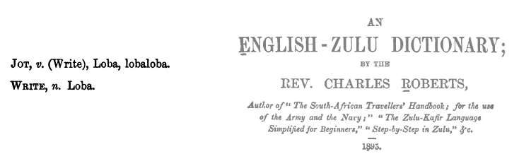

[](https://gemnasium.com/rdnewman/loba)
[](https://travis-ci.org/rdnewman/loba)
[](https://codeclimate.com/github/rdnewman/loba)
[](https://codeclimate.com/github/rdnewman/loba/coverage)
[](http://inch-ci.org/github/rdnewman/loba)
[](https://hakiri.io/github/rdnewman/loba/master)

# Loba



Easy tracing for debugging: handy methods for adding trace lines to output or Rails logs.

(Installation is pretty much what you'd expect for a gem, but read Environment Notes below first.)

## Overview

There are two kinds of questions I usually want to answer when trying to diagnose code behavior:

1. Is this spot of code being reached (or is it reached in the order I think it is)?
1. What is the value of this variable?

Loba statements are intended to be terse to minimize typing.  

Loba statements are intended to be minimally invasive and atomic.  They should not have any (much) more impact than a regular `puts` or `Rails.logger.debug` statement.

Loba statements are expected to be removed when you're done with them.  No point in cluttering up production code.

Loba will check for presence of Rails.  If it's there, it'll write to `Rails.logger.debug`.  If not, it'll write to STDOUT (i.e., `puts`).  Loba will work equally well with or without Rails.

Loba uses the [colorize gem](https://rubygems.org/gems/colorize) to help make trace statements more visible.

## Usage

My advice is to align Loba statements to the far left in your source code (a la `=begin` or `=end`) so they're easy to see and remove when you're done.

#### Timestamp notices:  `Loba.ts`

Outputs a timestamped notice, useful for quick traces to see the code path and easier than, say, [Kernel#set_trace_func](http://ruby-doc.org/core-2.2.3/Kernel.html#method-i-set_trace_func). Also does a simple elapsed time check since the previous timestamp notice to help with quick, minimalist profiling.

For example,

```
[TIMESTAMP] #=0002, diff=93.478016, at=1451444972.970602     (in=/home/usracct/src/myapp/app/models/target.rb:55:in `some_calculation')
```

To invoke,

```ruby
Loba.ts    # no arguments, generally (see Environment Notes below)
```

You can read [more detail](readme/ts.md) on this command.

#### Variable or method return inspection:  `Loba.val`

Inserts line to Rails.logger.debug (or to STDOUT if Rails.logger not available) showing value with method and class identification

```ruby
Loba.val :var_sym   # the :var_sym argument is the variable or method name given as a symbol
```

For example,

```
[Target.some_calculation] my_var: 54       (in /home/usracct/src/myapp/app/models/target.rb:55:in `some_calculation')
```

You can read [more detail](readme/val.md) on this command.

#### Snippet example

```ruby
require 'loba'    # not generally necessary in Rails projects
class HelloWorld
  def initialize
    @x = 42
Loba.ts          # see? it's easier to see what to remove later
    @y = "Charlie"
  end

  def hello
Loba.val :@x
    puts "Hello, #{@y}" if @x == 42
Loba.ts
  end
end
HelloWorld.new.hello
```

Output:

```  
[TIMESTAMP] #=0001, diff=0.000463, at=1451615389.505411   (in=/home/usracct/src/lobademo/hello_world.rb:4:in 'initialize'
[HelloWorld#hello] @x: 42       (in /home/richard/src/loba/spec/hello_world.rb:9:in `hello')
Hello, Charlie
[TIMESTAMP] #=0002, diff=0.000720, at=1451615389.506132   (in=/home/usracct/src/lobademo/hello_world.rb:11:in 'hello'
```

## Environment Notes

This section is only relevant in Rails environments.

The expectation is that Loba statements are just for development or test trace statements.  Generally, it's a bad idea to leave diagnostic code in Rails production; still, it can happen. And, occasionally, it can be useful to have trace statements in production too if you have an issue that is difficult to reproduce.

`Loba.ts` and `Loba.val` try to protect against timestamp or value notice requests being accidentally left in the code by checking for the Rails environment Loba is being invoked under. If in production, `Loba.ts` and `Loba.val` will normally just return immediately without rendering anything to help minimize any impact on production code. However, that behavior can be overridden with a `true` as an additional last argument to output a notice even when in the production environment.  In general, this should be done sparingly if at all.

These considerations also have an impact on how you install the Loba gem when using `bundler`. If you only install the gem for :development and :test, then any Loba statements left in the code when it goes to production will cause an error because the statements wouldn't be recognized. That's perhaps a Good Thing, if you never want them left in.

If you simply install the gem for all environments, then Loba will be available in production, but you may not notice as easily if some Loba calls are unintentionally left in. Of course, if you want those statements to work in production, then you should install the gem for all environments.

The following is the code example snippet but always logging even in Rails production environments:

```ruby
class HelloWorld
  def initialize
    @x = 42
Loba.ts(true)          # see? it's easier to see what to remove later
    @y = "Charlie"
  end

  def hello
Loba.val :@x, nil, true
    puts "Hello, #{@y}" if @x == 42
Loba.ts true
  end
end
HelloWorld.new.hello
```

## Installation

See above Environment Notes if using with Rails.

Add this line to your application's Gemfile:

```ruby
group :development, :test do
  gem 'loba', require: false, github: 'rdnewman/loba'   # until I publish it on RubyGems
end
```

or for all environments:

```ruby
gem 'loba', require: false, github: 'rdnewman/loba'   # until I publish it on RubyGems
```


And then execute:

    $ bundle

Or install it yourself as:

    $ gem install loba

## Development

After checking out the repo, run `bin/setup` to install dependencies. Then, run `rake spec` to run the tests. You can also run `bin/console` for an interactive prompt that will allow you to experiment.

To install this gem onto your local machine, run `bundle exec rake install`. To release a new version, update the version number in `version.rb`, and then run `bundle exec rake release`, which will create a git tag for the version, push git commits and tags, and push the `.gem` file to [rubygems.org](https://rubygems.org).

## Contributing

Bug reports and pull requests are welcome on GitHub at https://github.com/rdnewman/loba. This project is intended to be a safe, welcoming space for collaboration, and contributors are expected to adhere to the [Contributor Covenant](http://contributor-covenant.org) code of conduct.


## License

The gem is available as open source under the terms of the [MIT License](http://opensource.org/licenses/MIT).
